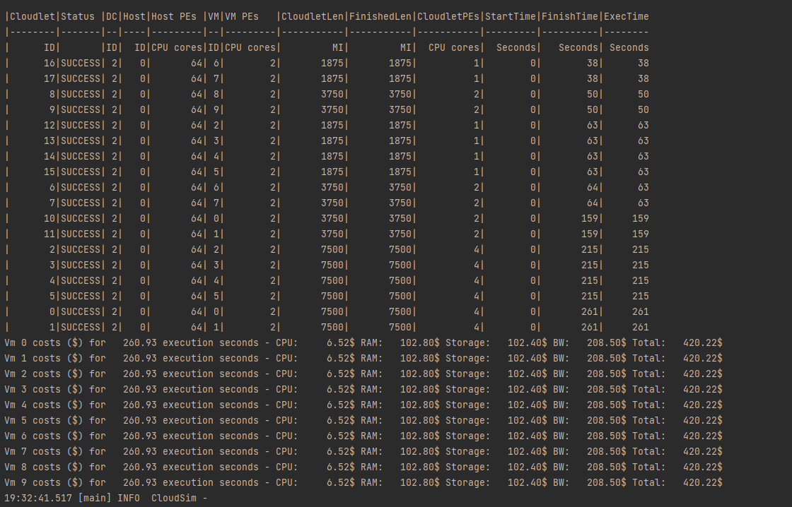
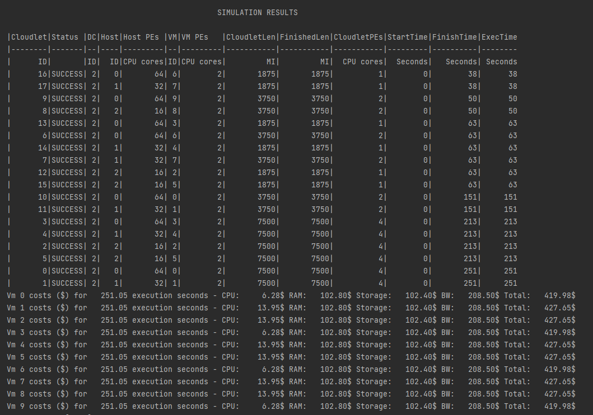
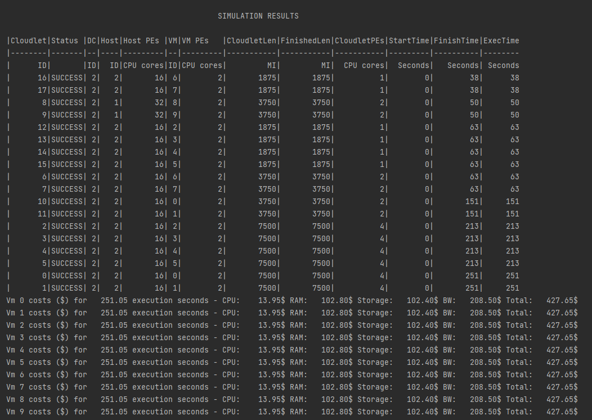
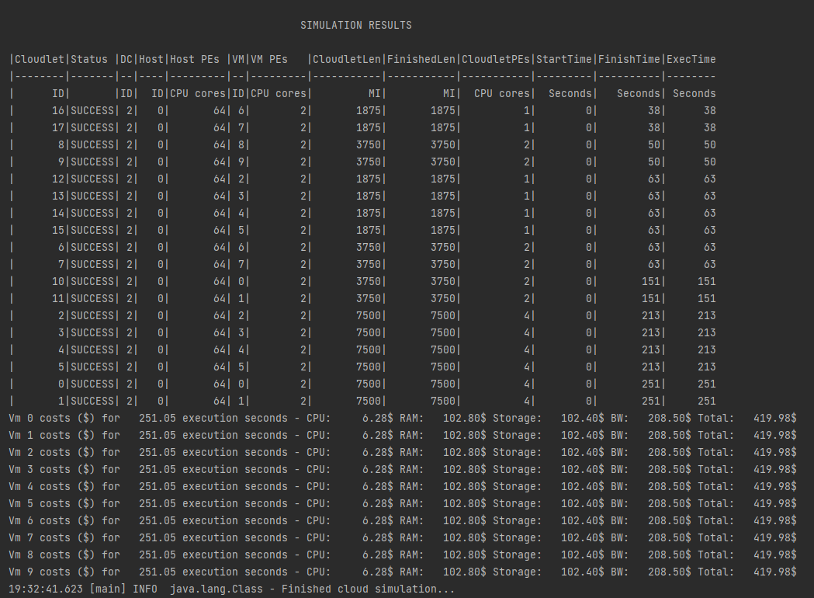

# Experiment 1
To test the VmAllocation policies:
1. Simple vmAllocation
2. Round Robin vmAllocation
3. Best Fit vmAllocation
4. First Fit vmAllocation

# Experiment Details
The number configuration is kept same for all the vm allocation policies and compare their performances

# Results
### Simple VmAllocation
A VmAllocationPolicy implementation that chooses,
as the host for a VM, that one with the fewest PEs in use. It is therefore a Worst Fit policy, allocating each VM into the host with most available PEs.

### Round-robin VmAllocation
A Round-Robin VM allocation policy which finds the next Host having suitable resources to place a given VM in a circular way. 
That means when it selects a suitable Host to place a VM, it moves to the next suitable Host when a new VM has to be placed. 
This is a high time-efficient policy with a best-case complexity O(1) and a worst-case complexity O(N), where N is the number of Hosts.

### BestFit VmAllocation
A Best Fit VmAllocationPolicy implementation that chooses, as the host for a VM, the one with the most number of PEs in use, which has enough free PEs for a VM.
This is a really computationally complex policy since the worst-case complexity to allocate a Host for a VM is O(N), where N is the number of Hosts.

### FirstFit VmAllocation
A First Fit VM allocation policy which finds the first Host having suitable resources to place a given VM. This is a high time-efficient policy with a best-case complexity O(1) and a worst-case complexity O(N), where N is the number of Hosts.

## Observations
The following was observed from the experiment:
1. The Allocation policy has no affect on the cost in the four mertics.
2. In each of the simulations, Vms are distributed differently. Simple and First Fit allocation are similar in the way the allote the VMs
3. In Round Robin the VM's are allocated in a sequential manner where VM1 is allocated to Host1, VM2 is allocated to Host2 and VM3 is allocated to Host3
4. In BestFit, most of the Vm's are assigned to the Host 2 as this is the best fit

