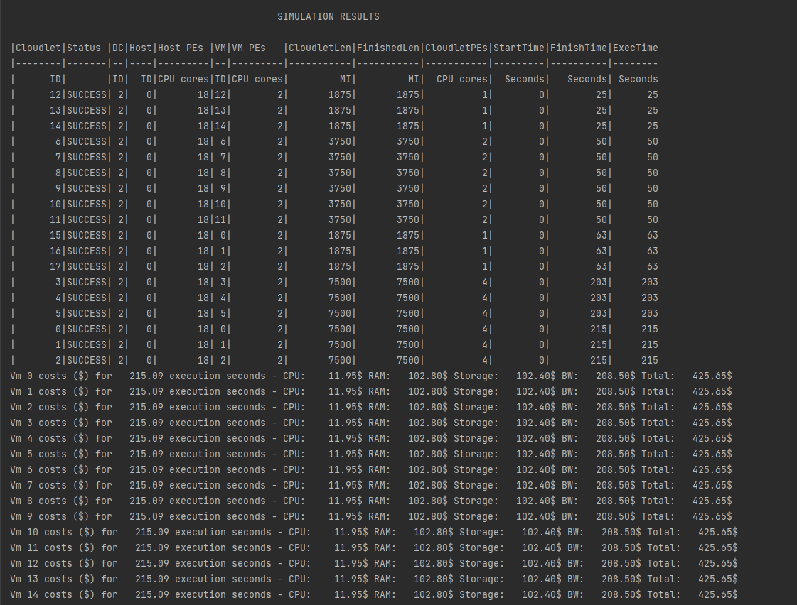
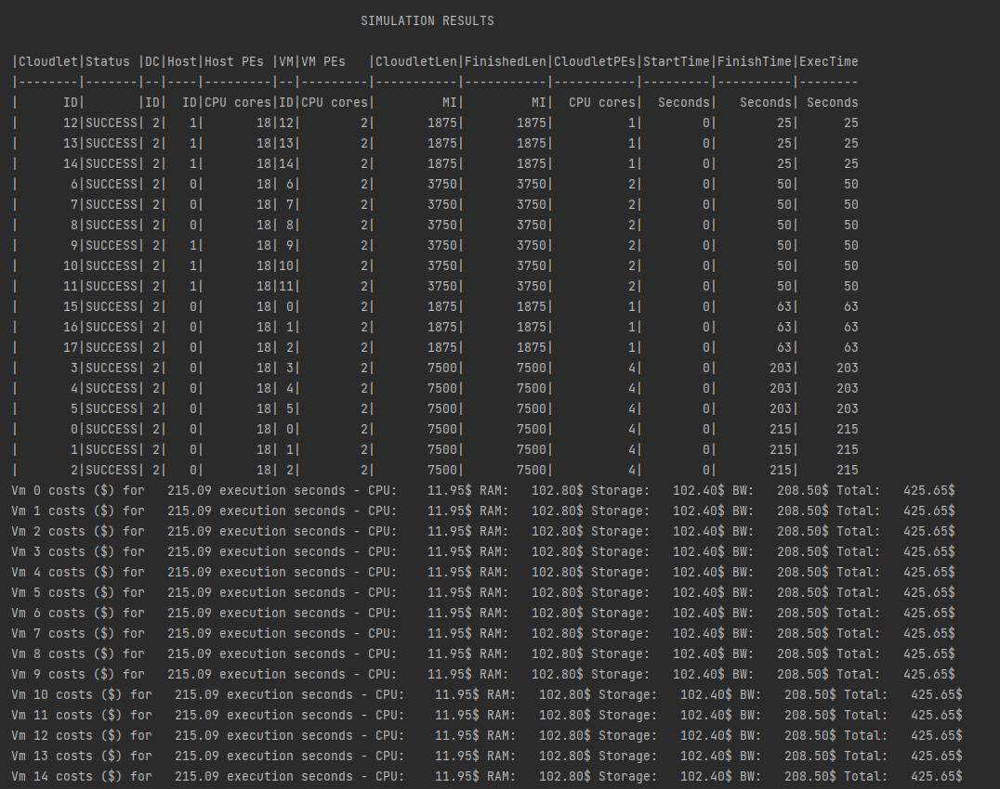
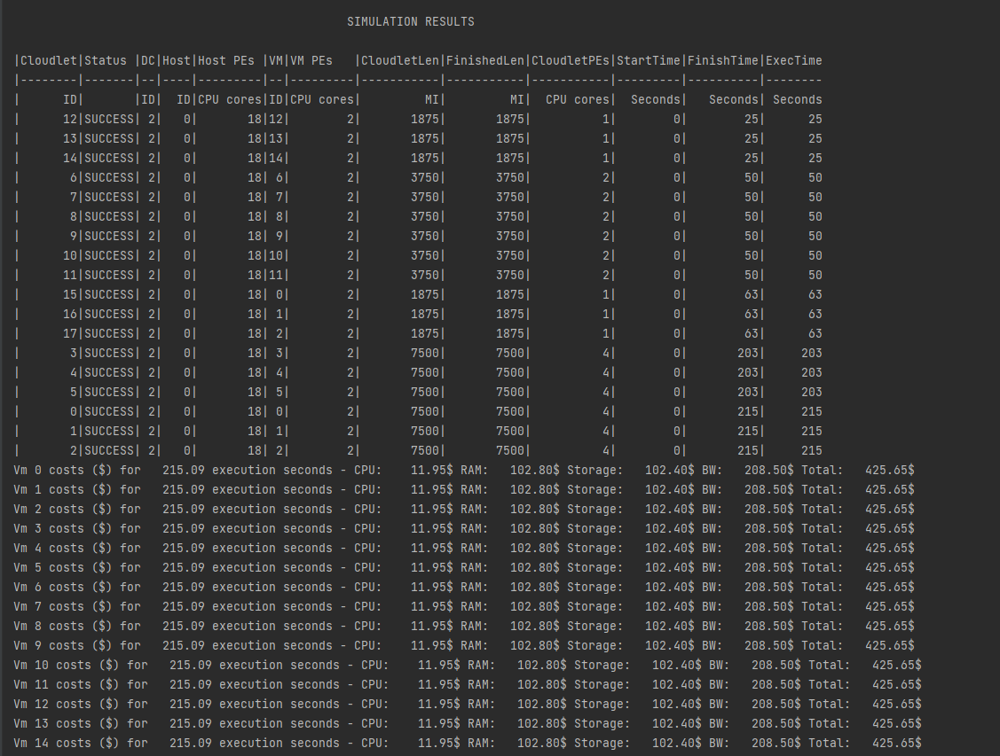

# Experiment 2
To Compare different VM scheduling policies:
1. Space Shared
2. Time Shared
3. Space + Time Shared

# Experiment Details
We run the simulation for the following 3 scenarios:
1. We have two hosts with SpaceShared Scheduling
2. We have two hosts with TimeShared Scheduling
3. We have one host SpaceShared and one host Timeshared

All the other configurations are kept same for the simulation.
The vMAllocation policy used is Best Fit.

# Results
### Simulation 1 : Both Hosts are Time shared
VmSchedulerTimeShared is a Virtual Machine Monitor (VMM), also called Hypervisor, that defines a policy to allocate one or more PEs from a PM to a VM, and allows sharing of PEs by multiple VMs.

### Simulation 2 : Both Hosts are Space Shared
VmSchedulerSpaceShared is a VMM allocation policy that allocates one or more PEs from a host to a Virtual Machine Monitor (VMM), and doesn't allow sharing of PEs. The allocated PEs will be used until the VM finishes running. If there is no enough free PEs as required by a VM, or whether the available PEs doesn't have enough capacity, the allocation fails. 
In the case of fail, no PE is allocated to the requesting VM.

### Simulation 3 : One host is Time Shared other Host is Space Shared

# Observations
The major observation of the whole simulation was that the number of Vm's had to be brought down to 15.

In SpaceShared scheduling, PE's are allocated to VM's. So if there are no sufficient PE's available then the simlation will
wait indefinitely for other VMs to release the resources

In TimeShared scheduling, Storage and RAM are allocated to the VM's. If there is no sufficient storage left, the simulator 
will wait for VM's to be destroyed and release the required resources.

The same behavior can be observed with CloudLet TimeShared and SpaceShared Schedulers.
