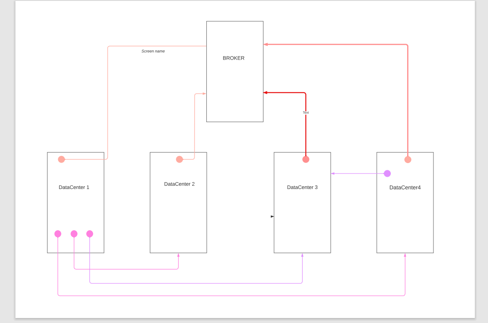
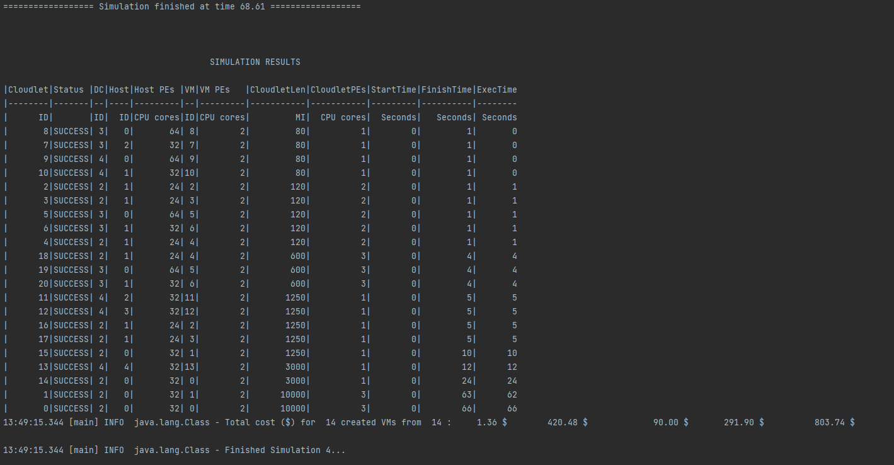

# Experiment 3
To simulate a network of 4 datacenters connect in brite topology.

The topology implemented will have a similar design as the below:

# Result

# Observations:
1. Here we have 4 data centers working together for all the cloudlets sent for processing.
2. The broker finds the first datacenter where it can host the vms. Then the vms are hosted
and cloudlets are executed in them.
3. We can also write multiple brokers with different logic to implement cloudlet logic between
the available datacenters.
4. Having the datacenter in this structure helps in reducing the wait time for execution of the 
cloudLets.