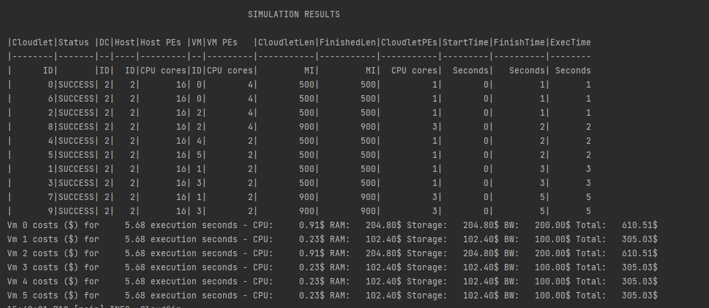
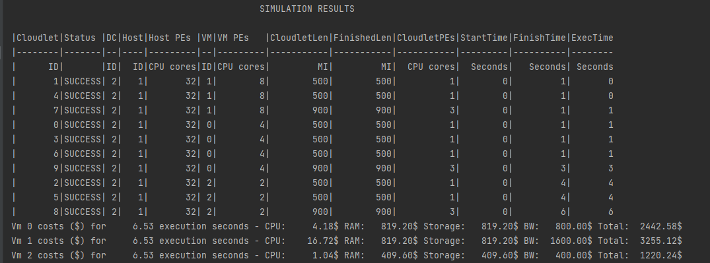
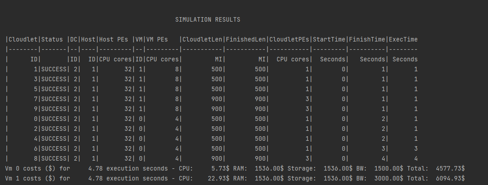

# Experiment Iaas
Created a simulation which provides user an option to select the following setting to run a Iaas system.

In the Iaas System, the user select the VM properties like Ram,Storage, PEs. The user can also
change the VmAllocation policy to have better performance.

# Experiment Details

1. Slow:
   1. 4 vms of
       * Ram        : 1024
       * Storage    : 1024
       * BandWidth  : 1000
       * Pes        : 2
       * Mips       : 1000
   2. 2 vms of 
       * Ram        : 2048
       * Storage    : 2048
       * BandWidth  : 2000
       * Pes        : 4
       * Mips       : 2000

2. Medium:
   1. 1 vms of
       * Ram        : 2048
       * Storage    : 2048
       * BandWidth  : 2000
       * Pes        : 4
       * Mips       : 2000
   2. 1 vm of 
       * Ram        : 2048
       * Storage    : 2048
       * BandWidth  : 4000
       * Pes        : 8
       * Mips       : 4000
   3. 1 vm of 
      * Ram        : 1024
      * Storage    : 1024
      * BandWidth  : 1000
      * Pes        : 2
      * Mips       : 1000

3. Fast: 
   1. 2 vms of 
       * Ram        : 2048
       * Storage    : 2048
       * BandWidth  : 4000
       * Pes        : 8
       * Mips       : 4000

# Results
### Slow setting

Metrics for each VM1 (Total 4 Vms)

| Metric            | Value         |
|-------------------|---------------|
| Execution seconds | 17.93 seconds |
| CPU Cost          | 0.23 $        |
| Ram Cost          | 102.40 $      |
| Storage Cost      | 102.40 $      |
| BW Cost           | 100 $         |
| Total Cost        | 305.03 $      |

Metrics for each VM2 (Total 2 Vms)

| Metric            | Value        |
|-------------------|--------------|
| Execution seconds | 5.68 seconds |
| CPU Cost          | 0.91 $       |
| Ram Cost          | 204.80 $     |
| Storage Cost      | 204.80 $     |
| BW Cost           | 100 $        |
| Total Cost        | 610.51 $     |

Total of all the VM = (305.03 * 4) + (610.51*2) = 2441.14 $

### Medium Setting

Metrics for each VM 1

| Metric            | Value        |
|-------------------|--------------|
| Execution seconds | 6.53 seconds |
| CPU Cost          | 4.18 $       |
| Ram Cost          | 819.20 $     |
| Storage Cost      | 819.20 $     |
| BW Cost           | 800 $        |
| Total Cost        | 2442.58 $    |

Metrics for each VM 2

| Metric            | Value        |
|-------------------|--------------|
| Execution seconds | 6.53 seconds |
| CPU Cost          | 16.72  $     |
| Ram Cost          | 819.20 $     |
| Storage Cost      | 819.20 $     |
| BW Cost           | 1600 $       |
| Total Cost        | 3255.12 $    |

Metrics for each VM 3

| Metric            | Value        |
|-------------------|--------------|
| Execution seconds | 6.53 seconds |
| CPU Cost          | 1.04  $      |
| Ram Cost          | 489.60 $     |
| Storage Cost      | 489.60 $     |
| BW Cost           | 400 $        |
| Total Cost        | 1220.24 $    |

Total of all the VM = 3255.12 + 2442.58 + 1220.24 = 6917.94 $

### High Setting

Metrics for each VM 1

| Metric            | Value        |
|-------------------|--------------|
| Execution seconds | 4.78 seconds |
| CPU Cost          | 5.73 $       |
| Ram Cost          | 1536.00 $    |
| Storage Cost      | 1536.00 $    |
| BW Cost           | 1500 $       |
| Total Cost        | 4577.73 $    |

Metrics for each VM 2

| Metric            | Value        |
|-------------------|--------------|
| Execution seconds | 4.78 seconds |
| CPU Cost          | 22.93 $      |
| Ram Cost          | 1536.00 $    |
| Storage Cost      | 1536.00 $    |
| BW Cost           | 3000 $       |
| Total Cost        | 6094.93 $    |

Total of all the VM = 4577.73 + 6094.93 = 10672.66 $

# Observations:
1. In this example, we are running two cloudLets application on 3 different settings.
2. The cloudlets setting can be changed from the application.conf.Iaas file
3. Here the execution time is nearly similar for all the simulations. Iaas gives the user
better access to the vm configurations through which we can have the best balance of cost and execution speed.
4. Here we can see we have hosted alot of low costing vms and this has helped us in achieving a good execution speed 
while keeping the total cost as low as possible.