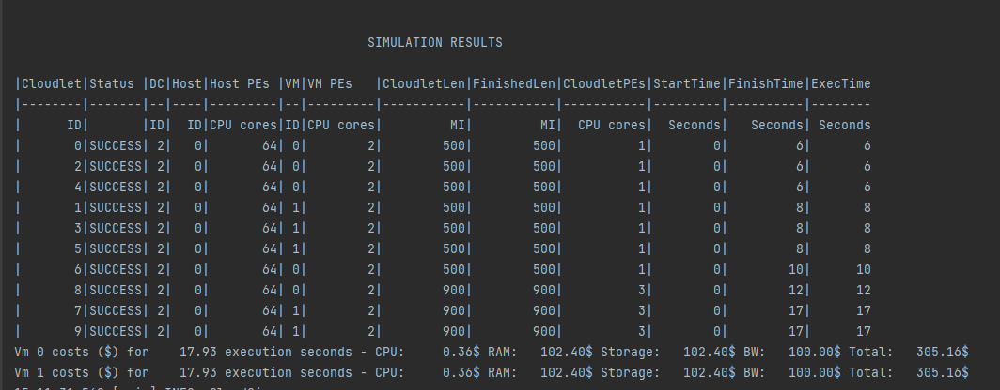
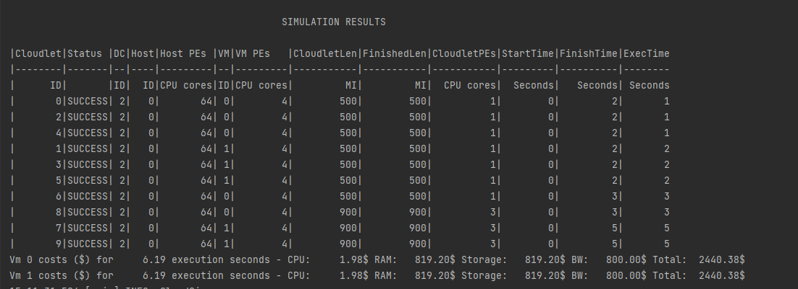
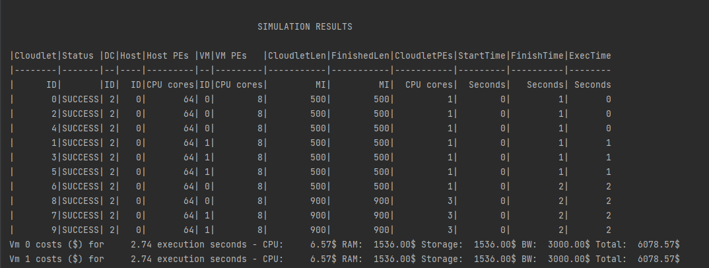

# Experiment Paas
Created a simulation which provides user an option to select the following setting to run a Paas system.

In the Paas System, the selected amount of vm's is two for each setting. This can be changed from the application.conf
file.

# Experiment Details

1. Slow (2 vms Each):
    * Ram        : 1024
    * Storage    : 1024
    * BandWidth  : 1000
    * Pes        : 2
    * Mips       : 1000

2. Medium (2 vms Each):
    * Ram        : 2048
    * Storage    : 2048
    * BandWidth  : 2000
    * Pes        : 4
    * Mips       : 2000

3. Fast (2 vms Each):
    * Ram        : 2048
    * Storage    : 2048
    * BandWidth  : 4000
    * Pes        : 8
    * Mips       : 4000

# Results
### Slow setting

Metrics for each VM

| Metric            | Value         |
|-------------------|---------------|
| Execution seconds | 17.93 seconds |
| CPU Cost          | 0.36 $        |
| Ram Cost          | 102.40 $      |
| Storage Cost      | 102.40 $      |
| BW Cost           | 100 $         |
| Total Cost        | 305.16 $      |

Total of all the VM = 305.16 * 2 = 610.32 $

### Medium Setting

Metrics for each VM

| Metric            | Value        |
|-------------------|--------------|
| Execution seconds | 6.19 seconds |
| CPU Cost          | 1.98 $       |
| Ram Cost          | 819.20 $     |
| Storage Cost      | 819.20 $     |
| BW Cost           | 800 $        |
| Total Cost        | 2448.38 $    |

Total of all the VM = 2448.38 * 2 = 4,896.76 $

### High Setting

Metrics for each VM

| Metric            | Value        |
|-------------------|--------------|
| Execution seconds | 2.74 seconds |
| CPU Cost          | 6.57 $       |
| Ram Cost          | 1536.00 $    |
| Storage Cost      | 1536.00 $    |
| BW Cost           | 3000 $       |
| Total Cost        | 6078.57 $    |

Total of all the VM = 6078.57 * 2 = 12,157.14 $

### Observations:
1. In this example, we are running two cloudLets application on 3 different settings.
2. The cloudlets setting can be changed from the application.conf.Paas file
3. The execution speed is doubled for the cloudlets when compared to the Saas setup and the total cost has only doubled
providing a better balance between speed and cost.
4. The cost to speed ratio between the slow settings and high settings is only 5 times compared to Saas. The cost
difference has reduced in the two implementations.