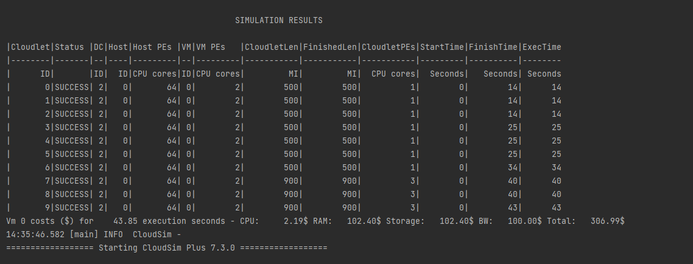
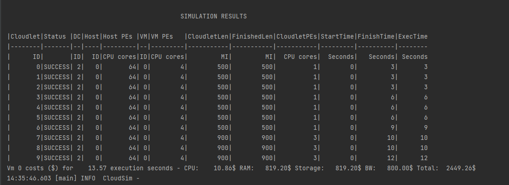
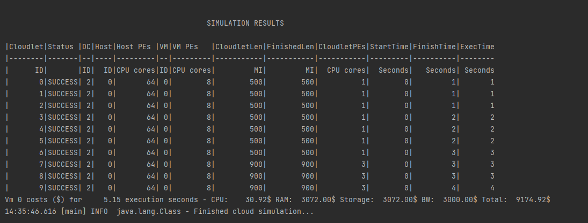

# Experiment Saas
Created a simulation which provides user an option to select the following setting to run a Saas system.

# Experiment Details

1. Slow:
    * Ram        : 1024
    * Storage    : 1024
    * BandWidth  : 1000
    * Pes        : 2
    * Mips       : 1000

2. Medium:
    * Ram        : 2048
    * Storage    : 2048
    * BandWidth  : 2000
    * Pes        : 4
    * Mips       : 2000

3. Fast
    * Ram        : 4096
    * Storage    : 4096
    * BandWidth  : 4000
    * Pes        : 8
    * Mips       : 4000

# Results
### Slow setting

| Metric            | Value           |
|-------------------|-----------------|
| Execution seconds | 43.85 seconds   |
| CPU Cost          | 2.19 $          |
| Ram Cost          | 102.40 $        |
| Storage Cost      | 102.40 $        |
| BW Cost           | 100 $           |
| Total Cost        | 306.99 $        |

### Medium Setting

| Metric            | Value         |
|-------------------|---------------|
| Execution seconds | 13.57 seconds |
| CPU Cost          | 10.86 $       |
| Ram Cost          | 819.20 $      |
| Storage Cost      | 819.20 $      |
| BW Cost           | 800 $         |
| Total Cost        | 2449.26 $     |

### High Setting

| Metric            | Value        |
|-------------------|--------------|
| Execution seconds | 5.15 seconds |
| CPU Cost          | 30.92 $      |
| Ram Cost          | 3072.00 $    |
| Storage Cost      | 3072.00 $    |
| BW Cost           | 3000 $       |
| Total Cost        | 9174.92 $    |

### Observations:
1. In this example, we are running two cloudLets application on 3 different settings.
2. The cloudlets setting can be changed from the application.conf.Saas file
3. The execution speed goes high when more resources are available for the cloudlet. This also leads to 
increase in the cost of the execution.
4. To achieve high performance in Saas environment the cost is quiet high when compared to the slow option.
The slow option is also nearly 8 times slower than the fast, but is 30 times cheaper.
5. This can be used as a baseline to find a balance when designing a Paas or Iaas infrastructure for the application.